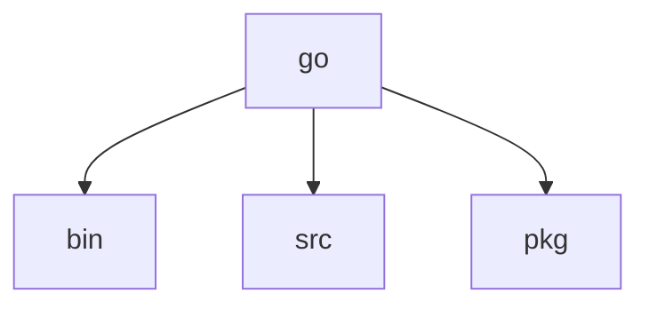

<h1 align='center'>Cats breed api project using goleng Beego Framework </h1>

## Prerequisites
  - Inatall go version 1.19
 
## First create those directory 
- [x] `mkdir go` `cd go`
- [x] `mkdir bin src pkg`

  
## Setup GOPATH, GOBIN and GOENV variables:
> For linux:
 - `export GOPATH=/usr/local/go`
 - `export GOBIN=/usr/local/go/bin`
 - `export GOENV=/usr/local/go`
> For Windlow:
 - `set GOPATH=D:\go`
 - `set GOBIN=D:\go\bin`
 - `set GOENV=D:\go`
 
## Create mod file
  - (Outside GOPATH) run `go mod init go` and then `go mod tidy` on terminal 
  
## Install Beego
  - `go get github.com/astaxie/beego`
  - for windows `go install github.com/beego/bee/v2@latest;`
  
# Install dependencies:
  - `go get -u github.com/beego/beego/v2@latest`
  - `go get -u github.com/beego/bee/v2@latest`
  - `go get github.com/beego/beego/v2/server/web@v2.0.4`
  - For env `go get github.com/joho/godotenv`
  - For cache `go get github.com/patrickmn/go-cache`

## How to Run this Project

  - First of all clone this Project
  - Now go to the download directory
  - Extract this File
  - move this project `/usr/local/go/src` directory
  - go to project directory
  - Rename `.env sample` to `.env` and enter your api key
  - run `bee run`
  - `http://localhost:8080` type on your browser

## Helpful commands
  - `go version` "for check go version"
  - `bee version` "for check bee version"
  - `bee new project-name` "For create new bee project"

